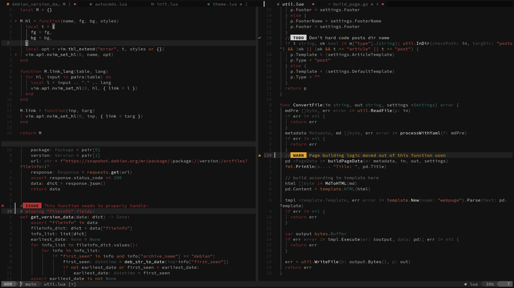

# Ashen

_Coding is already hard on the brain, so it should at least be easy on the
eyes._

Ashen is a warm, muted colorscheme that evokes the feeling of embers sizzling
out in an old fire pit. It features red & orange tones, plenty of grayscale, and
hints of teal.



<!-- prettier-ignore-start -->
> [!WARNING]
> This theme is still in early development: the palette and theming
> may be subject to change.
<!-- prettier-ignore-end -->

## Contents

<!--toc:start-->

- [Features](#features)
- [Installation](#installation)
- [Plugins](#plugins)
- [Configuration](#configuration)
- [Plugin Configuration](#plugin-configuration)
- [Extras](#extras)
- [Acknowledgements](#acknowledgements)
- [Roadmap](#roadmap)
- [Contributing](#contributing)
<!--toc:end-->

## Features

- Warm, cozy, muted palette that's easy on the eyes.
- Incredibly fast load time.
- Optional transparency.
- Palette and highlight group overriding.
- Customizable terminal palette.
- Extensive [plugin](#plugins) support.
- [Extra themes](#extras) for other software.

## Installation

Using [lazy.nvim](https://lazy.folke.io/):

```lua
{
  "ficcdaf/ashen.nvim",
  -- optional but recommended,
  -- pin to the latest stable release:
  tag = "*",
  lazy = false,
  priority = 1000,
  -- configuration is optional!
  opts = {
    -- your settings here
  },
}
```

You can load Ashen anywhere in your Neovim configuration. You only need to call
`setup` if you want to change any settings!

```lua
vim.cmd("colorscheme ashen")
-- You may call the load function as well
-- Do NOT call them both; they both do
-- the same thing!
require("ashen").load()
```

If you're using [LazyVim](https://www.lazyvim.org/), I recommend the following:

```lua
return {
  { "ficcdaf/ashen.nvim" },
  {
    "LazyVim/LazyVim",
    opts = {
      colorscheme = "ashen",
    },
  }
}
```

You can also configure `lazy.nvim` to use Ashen while installing plugins:

```Lua
require("lazy").setup({
  install = {
    colorscheme = {"ashen"}
  }
})
```

## Plugins

Many plugins are already "supported" because they use standard Neovim highlight
groups. However, some plugins require explicit support from color schemes.
Additionally, some plugins may require extra setup to work with Ashen. Please
see [Plugin Configuration](#plugin-configuration) for more details.

| Plugin               | Requires Configuration |
| -------------------- | ---------------------- |
| blink.cmp            |                        |
| nvim-cmp             |                        |
| flash.nvim           |                        |
| lualine              | X                      |
| mini.icons           |                        |
| trailblazer.nvim     | X                      |
| obsidian.nvim        |                        |
| oil.nvim             |                        |
| render-markdown.nvim |                        |
| telescope.nvim       |                        |
| minimap.vim          |                        |
| neogit               |                        |
| FzfLua               | X                      |
| fzf.vim              |                        |
| org-bullets.nvim     |                        |
| lazy.nvim            |                        |

## Configuration

<!-- prettier-ignore-start -->
> [!WARNING]
> If you choose to set any options, please note that `setup` _only_
> sets up the configuration and does **not** load the theme! You must call
> `colorscheme ashen` or `require("ashen").load()` _after_ `setup`!
<!-- prettier-ignore-end -->

You can pass an options table to the `setup` function to configure Ashen, the
same you would any other plugin. If you use `lazy.nvim`, you can set options as
shown in [installation](#installation)!

```Lua
require("ashen").setup({
  -- your settings here
})
-- theme must be loaded *after* setup!
vim.cmd("colorscheme ashen")
```

The default settings will work for most people. However, extensive configuration
options are provided.

<!-- prettier-ignore-start -->
> [!TIP]
> If you are not changing any of the defaults, avoid calling `setup` or
> setting any `opts` -- your startup time will be faster!
<!-- prettier-ignore-end -->

All available settings, along with their default values, are listed below. User
provided settings will be merged with the defaults.

<details>
  <summary>Available Settings</summary>

```Lua
-- default settings
{
  -- toggle text style options
  ---@type table<StyleName, boolean>
  style = {},
  -- toggle group specific settings
  style_presets = {
    bold_functions = false,
    italic_comments = false,
  },
  --- override palette colors
  ---@type Palette
  ---@field [ColorName] HexCode
  colors = {},
  -- override highlight groups
  hl = {
    ---Overwrite; omitted fields are cleared
    ---@type HighlightMap
    force_override = {},
    ---Merge fields with defaults
    ---@type HighlightMap
    merge_override = {},
    ---Link Highlight1 -> Highlight2
    ---Overrides all default links
    ---@type table<HighlightName, HighlightName>
    link = {},
  },
  -- use transparent background
  -- (requires terminal support)
  transparent = false,
  -- force clear other highlights
  -- even if no other theme is set
  force_hi_clear = false,
  -- set built-in terminal colors
  terminal = {
    -- if disabled, Neovim terminal will
    -- use your terminal emulator's theme
    enabled = true,
    ---override terminal palette
    ---@type AnsiMap
    colors = {},
  },
  -- configure plugin integrations
  plugins = {
    -- automatically load plugin integrations
    autoload = true,
    ---if autoload: plugins to SKIP
    ---if not autoload: plugins to LOAD
    ---@type string[]
    override = {},
  },
}
```

</details>

### Style

You can disable _all_ uses of a certain style with the following setting:

```Lua
opts = {
  style = {
    bold = false,
    italic = false,
    -- etc...
  },
}
```

### Style Presets

The following presets are available. They are off by default, and you may choose
to enable them in your configuration:

```Lua
opts = {
  style_presets = {
    bold_functions = true,
    italic_comments = true,
  },
}


```

### Palette Override

<details>
<summary>Click to expand</summary>

You can override any color in Ashen's palette, or set new colors entirely. The
`colors` setting accepts a table of `ColorName = HexCode` pairs, where they are
both strings, with `ColorName` corresponding to an Ashen color, and `HexCode`
being a `#` prefixed hexadecimal color code. For an list of available color
names, please see [colors.lua](./lua/ashen/colors.lua).

Please see the following example:

```Lua
opts = {
  colors = {
    background = "#000000",
    red_ember = "#933737"
  },
}
```

</details>

<!-- prettier-ignore-start -->
> [!TIP]
> Made a palette you're proud of? It could become Ashen's next "theme
> variant" -- don't be afraid to open a feature request for it!
<!-- prettier-ignore-end -->

### Highlight Override

<details>
<summary>Click to expand</summary>

You can find a detailed explanation of the HighlightMap type below.

<details>
<summary>Explanation of HighlightMap type</summary>

```Lua
---@alias HighlightSpec [FgHexCode?, BgHexCode?, Style?]
-- The colors *must* be in this ^^^ order. If you want
-- to set a background but no foreground, you MUST pass
-- nil for the FgHexCode!
-- example:
{ "#FFFFFF" } -- set only foreground
{ "#FFFFFF", "#000000" } -- set foreground and background
{ nil, "#000000" } -- set only background

-- Please see `:h nvim_set_hl()` -> {val}
-- for the possible style table options.
---@alias Style table<string, boolean|string|integer>
-- example:
{ bold = true, underline = true }

-- You may pass a style table as the LAST element
-- of a HighlightSpec.
{ "#FFFFFF", "#000000", { bold = true, underline = true } }
-- The style table can be the only element, too.
{ { bold = true, underline = true } }
-- Or you may pass a "normalized" table as well:
{ fg = "#FFFFFF", bold = true }


---@alias HighlightMap table<HighlightName, HighlightSpec>
-- Example of a HighlightMap:
{
  Normal = { "#FFFFFF", "#000000", { bold = true, underline = true } },
  ["@function.macro"] = { "#B14242" },
}
```

</details>

Users can override Ashen's highlight group definitions, or set new ones
entirely. There are two options under the `hl` setting: `force_override` and
`merge_override`.

The former will _completely_ overwrite the given highlight group; existing
properties are **not** preserved. An empty table `{}` means Ashen will _clear_
that highlight group.

The latter will _merge_ properties: it will override _only_ the properties you
specify, and keep non-conflicting Ashen defaults.

You can also _link_ arbitrary highlight groups. Links defined in `hl.link` take
priority over all other links set by Ashen. `hl.link` must be a key-value table
in which the key is the link's _origin_ and the value is its _target_.

Note that both **hexadecimal color codes** and **Ashen color names** are valid
inputs for color parameters.

```Lua
-- full example
hl = {
  -- overwrite every field
  ---@type HighlightMap
  force_override = {
    Normal = { "red_ember", "#000000", { bold = true, underline = true } },
  },
  -- keep untouched fields
  ---@type HighlightMap
  merge_override = {
    ["@function.macro"] = { "#B14242" },
  },
  ---@type table<HighlightName, HighlightName>
  link = {
    -- link FlashBackdrop to Normal
    FlashBackdrop = "Normal",
  },
},
```

</details>

### Terminal Palette

<details>
<summary>Click to expand</summary>

The following explanation of the terminal palette applies to both the Neovim
terminal and some [extra](#extras) themes.

<details>
<summary>Explanation of terminal palette</summary>

The palette for the built-in Neovim terminal follows the standard 16-color Xterm
palette. `ashen.nvim` sets these to the same colors as in the terminal theme
[extras](#extras).

Note that, by default, many palette colors do not match their expected "names"
-- for example, `green` is set to a shade of orange. This is to stay consistent
with Ashen's visual identity; while Ashen does _have_ a green color in its
Neovim palette, setting it in the terminal theme results in an overuse of the
color; which appears jarring in contrast with how Ashen looks in Neovim.

Furthermore, note that the `bright` colors (except `bright black`) are set to
the _same_ color codes as their "regular" counterparts. This is for consistency
with Ashen's minimal Neovim palette -- as a design goal, the terminal themes
should not appear jarring next to the standard Neovim theme.

The default terminal palette is carefully selected to maintain the visual feel
while retaining important semantic meanings, such as `red` and `yellow` for
errors and warnings in compiler output.

A mapping of index to Xterm color names is provided below.

| Index | Color          |
| ----- | -------------- |
| 0     | black          |
| 1     | red            |
| 2     | green          |
| 3     | yellow         |
| 4     | blue           |
| 5     | magenta        |
| 6     | cyan           |
| 7     | white          |
| 8     | bright black   |
| 9     | bright red     |
| 10    | bright green   |
| 11    | bright yellow  |
| 12    | bright blue    |
| 13    | bright magenta |
| 14    | bright cyan    |
| 15    | bright white   |

</details>

The `terminal.colors` field of the `opts` table should be a mapping of Xterm
indexes to hexadecimal color codes. Please note that the indexes are a C-style
zero indexed array and _not_ a Lua array - the count starts from `0`, not `1`!

```Lua
---@alias AnsiMap table<integer, HexCode> -- where integer ∈ [0, 15]
```

Please see the following example:

```Lua
terminal = {
  colors = {
    -- override black
    [0] = "#000000",
    -- override bright green
    [11] = "#AADB1E",
  },
}
```

</details>

### Plugin Integration Settings

<details>
<summary>Click to expand</summary>

Plugin integration settings can be set under the `opts.plugins` table:

```Lua
{
  plugins = {
    autoload = true,
    ---@type string[]
    override = {},
  },
}
```

#### Autoload

By default, plugin integrations are automatically loaded. To disable this
behaviour, you can set `plugins.autoload` to `false`.

<details>
<summary>Exceptions</summary>
  
  - `trailblazer` needs to be loaded manually even if `plugins.autoload == true`.

</details>

#### Manual Loading

You can manually load any plugin integration on-demand in your Neovim config by
using the `load_plugin` function. The same naming rules apply as for
`plugins.override`, please see below for more details.

```Lua
-- example
require("ashen.plugins").load_plugin("flash")
```

#### Override

You can provide a list of plugin names as an "override". The names must match
the filenames in [lua/ashen/plugins](./lua/ashen/plugins/), with the `.lua`
extension removed, and exclude `init.lua`.

For example:

```Lua
{
  -- flash.nvim
  "flash",
  -- mini.icons
  "mini-icons",
}
```

Overriding behaves differently depending on whether autoloading is enabled. If
`plugins.autoload` is set, the overridden plugins will **not** be loaded
automatically. If autoloading is disabled, the overridden plugins **will** be
loaded automatically.

</details>

## Plugin Configuration

### FzfLua

<details>
<summary>Click to expand</summary>

If FzfLua's colors aren't looking quite right, please make sure that you have
disabled `fzf_colors` in the settings:

```Lua
{
  "ibhagwan/fzf-lua",
  opts = {
    -- must be false for the Ashen
    -- integration to work properly!
    fzf_colors = false,
  },
}
```

</details>

### Lualine

<details>
<summary>Click to expand</summary>

Ashen comes with a preconfigured Lualine theme that includes a word counter for
Markdown, Text, and Latex files. Optionally,
[noice.nvim](https://github.com/folke/noice.nvim) is used to indicate Macro
recording status, and [pomo.nvim](https://github.com/epwalsh/pomo.nvim) is
supported. The following is an example of how to configure Lualine to use Ashen:

```lua
return {
  "nvim-lualine/lualine.nvim",
  -- ensure Ashen is loaded first
  dependencies = {
    "ficcdaf/ashen.nvim",
  },
  opts = function()
    local ashen = require("ashen.plugins.lualine").lualine_opts
    -- you can set any other options
    -- expected by lualine, since this
    -- table will be passed directly to `setup`
    ashen.extensions = { "lazy", "fzf" }
    return ashen
  end,
}
```

> I am working on improving the word counter and releasing it as a separate
> plugin. When that happens, Ashen will be updated to support it out of the box.

</details>

### Trailblazer.nvim

<details>
<summary>Click to expand</summary>

Trailblazer tends to overwrite the highlight groups set by Ashen. Therefore, you
may need to invoke Ashen's Trailblazer setup immediately _after_ loading
Trailblazer. Please see the following example:

```lua
return {
  "LeonHeidelbach/trailblazer.nvim",
  event = "UIEnter",
  -- ensure Ashen is loaded first
  dependencies = {
    "ficcdaf/ashen.nvim",
  },
  config = function()
    require("trailblazer").setup({
      -- your Trailblazer setup here
    })
    -- This ensures Ashen's HL groups are set up
    -- AFTER Trailblazer sets its own.
    require("ashen.plugins").load_plugin("trailblazer")
  end,
}
```

</details>

### Render-markdown.nvim

<details>
<summary>Click to expand</summary>

Ashen will support `render-markdown` OOTB with no additional configuration. You
may optionally consider including the following icons in your setup. Note they
may not render properly in all browsers.

```lua
-- as part of render-markdown.nvim setup
opts = {
  bullet = {
    -- cleaner bullet points
    icons = { "•", "∙" },
  },
  heading = {
    -- Icons that say H1, H2, etc.
    icons = { "󰉫 ", "󰉬 ", "󰉭 ", "󰉮 ", "󰉯 ", "󰉰 " },
  },

}
```

</details>

## Extras

Extras can be found [here](./extras/). Installation instructions can be found in
their respective folders.

<!-- prettier-ignore-start -->
> [!TIP] 
> Missing an extra? Open an issue and request it, or try porting it
> yourself!
<!-- prettier-ignore-end -->

### Terminal Emulators

- Ghostty
- Kitty
- Alacritty
- Windows Terminal
- WezTerm
- foot

### CLI

- bat
- eza
- lazygit
- yazi

### Environment

- waybar
- sway

## Acknowledgements

Ashen was inspired by
[nvim-noirbuddy](https://github.com/jesseleite/nvim-noirbuddy).

## Roadmap

Theme variants and massive performance overhauls are in the works.

Please refer to the [issues](https://github.com/ficcdaf/ashen.nvim/issues) page
for a detailed roadmap.

## Contributing

If you want a certain plugin or extra to be added, please open an issue and I'll
get to it as soon as I can. If you want to contribute, please read the
[contribution guidelines](/CONTRIBUTING.md).

## Support My Work

I'm a busy & broke graduate student doing my best to develop and maintain this
plugin. If you feel that Ashen has added value to your Neovim experience, you
may consider [buying me a coffee](https://ko-fi.com/ficcdaf). Your support is
greatly appreciated but never expected. Thanks!
