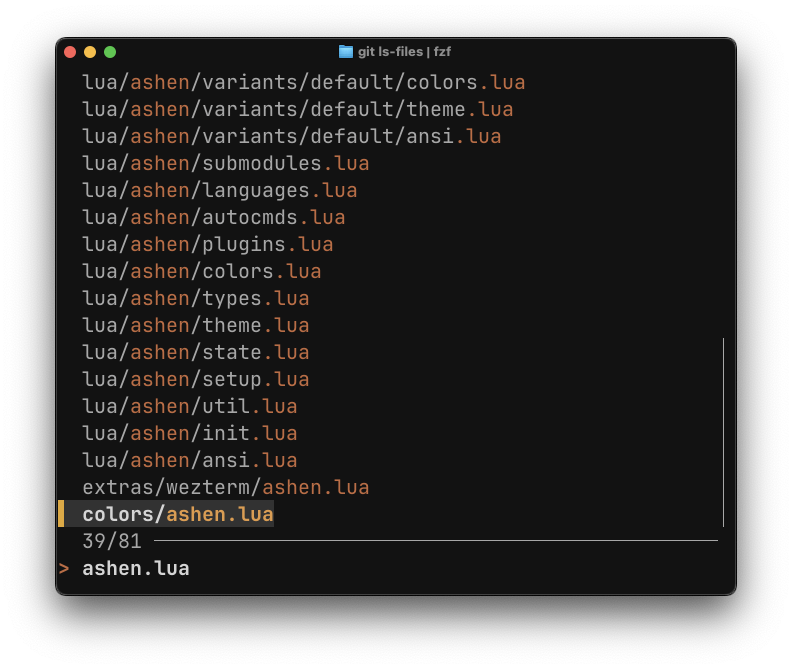

# FZF Extra

## 👀 Preview

## 🎨 Installation

Copy the contents of `ashen.sh` to `~/.profile`, `~/.zshrc`, `~/bashrc`, or
similar.

If you changed any other `FZF_DEFAULT_OPTS`, make sure to include Ashen's code
_after_ you have made your changes!
